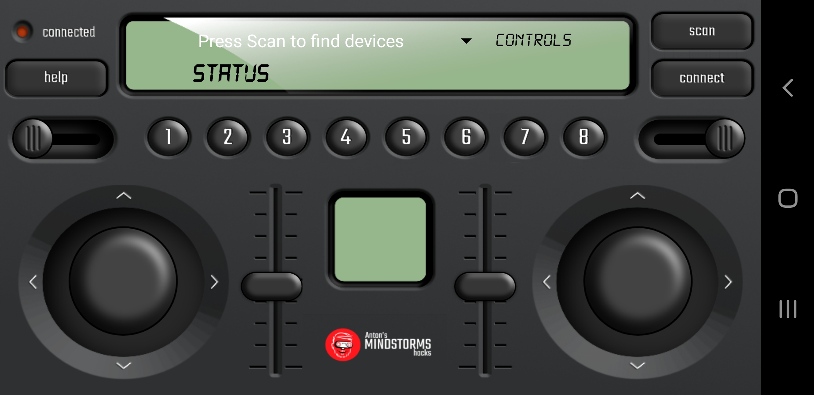

# MINDSTORMS Remote Control

## Android app

The Android App is written using http://kodular.io. The graphics are designed by Anton from http;//antonsmindstorms.com.



## Protocol

## SPIKE / MINDSTORMS python application

The Android applications sends a structure containing all the controls from the RC to the robot.

|control | type | values |
|--------|------|-------|
|l_stick_hor |b | -100 to 100 |
| l_stick_ver|b | -100 to 100 |
| r_stick_hor|b | -100 to 100 |
| r_stick_ver|b | -100 to 100 |
|l_slider|b | -100 to 100 |
|r_slider|b | -100 to 100 |
|setting1|b | -100 to 100 |
|setting2|b | -100 to 100 |
|buttons_bits| B | each button is encoded as a single bit| 

### receiving controls
On the robot the following code snippet is used for decoding the controls:

```python
def on_rx(control):
    global l_stick_hor, l_stick_ver, r_stick_hor, r_stick_ver, l_slider, r_slider, setting1, setting2, buttons
    #print(control)
    l_stick_hor, l_stick_ver, r_stick_hor, r_stick_ver, l_slider, r_slider, setting1, setting2, buttons_char = struct.unpack("bbbbbbbbB", control)
    for i in range(8):
         if buttons_char & 1 << i:
             buttons[i]=1
         else:
             buttons[i]=0
```

### Sending informaton to the RC
The robot can send a command to the RC as a string. Currently the following types of commands are supported and are recognised by the first character:

|starting character | command |
|-------------------|---------|
|I| display image in square LCD screen |
|T| display status text
|L| set left slider to value|
|R| set right slider to value|
|S| text-to-speech |

Here are some example commands:
|example | effect |
|-----------------|---------|
|Image('35790:00000:00000:00000:00000')| the Image is displayed in the little square LCD screen on the RC |
|TThis is an example text| Displays 'This is an example text' in the status screen |
|L50| Set left slider to the value of 50 |
|SCan you hear this?| Says 'Can you hear this?'|

Below is an example were the robot send periodically an image to the RC and where it reacts on button 7 and 8  by displaying a string in the status window.

```python
t1=time.ticks_ms()
# Control loop
n=0
while True:
    if receiver.is_connected():
        if time.ticks_diff(time.ticks_ms(),t1)>100:
            t1=time.ticks_ms()
            try:
                receiver.send(repr(_CONNECT_IMAGES[n%15])) # send Image to the RC
                receiver.send("L%d"%((n%15)*10)) # set value of left slider
                n+=1
            except:
                print("Error sending data")
        # Beep on any button press
        if buttons[7]:
            buttons[7]=0
            receiver.send("TDit is een status regel knop 8") # send text to be displayed in status bar
        if buttons[6]:
            buttons[6]=0
            receiver.send("TDit is een status regel knop 7") # send text to be displayed in status bar
    
```
